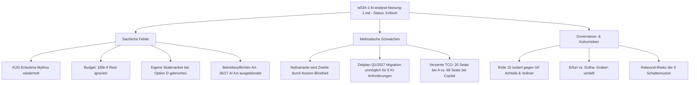
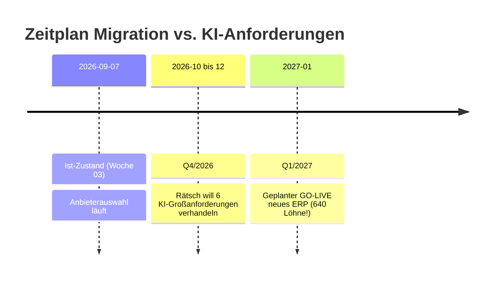
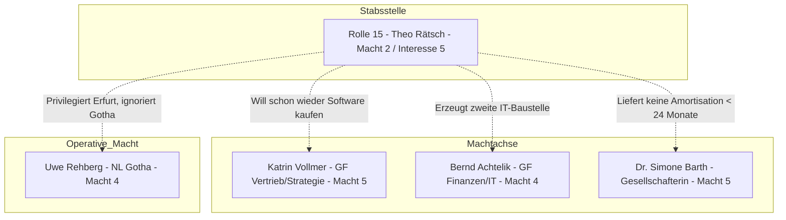
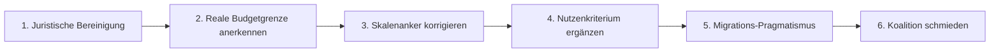

# Review und kritische Würdigung der KI-Analyse (`w03A-1-ki-analyse-fassung-1.md`)

> **Gegenstand dieser Prüfung:** Detaillierte Analyse und Bewertung des Dokuments [`w03A-1-ki-analyse-fassung-1.md`](w03A-1-ki-analyse-fassung-1.md) (Stand: 07.09.2026, Woche 03) auf Basis des gesamten Unternehmensprofils der GeAT mbH (Identität, Finanzgerüst, System- und Datenlandschaft, Stakeholder-Gefüge, Vorhaben und Transformationsplanung).
>
> **Ziel:** Identifikation aller sachlichen Fehler, methodischen Schwächen, budgetären Widersprüche, regulatorischen Fehleinschätzungen und organisatorischen Risiken, bevor die Vorlage die Geschäftsführung oder die Gesellschafterversammlung erreicht.

---

## Inhaltsverzeichnis

1. [Management Summary & Gesamtfazit](#1-management-summary--gesamtfazit)
2. [Kategorie I: Sachliche Fehler & faktische Widersprüche](#2-kategorie-i-sachliche-fehler--faktische-widersprüche)
   - [Fehler 1: Der widerlegte AÜG-Erlaubnis-Mythos](#fehler-1-der-widerlegte-aüg-erlaubnis-mythos-bundesagentur-für-arbeit)
   - [Fehler 2: Budgetäre Blindheit – Verdrängung des geschrumpften Investitionsspielraums](#fehler-2-budgetäre-blindheit--verdrängung-des-geschrumpften-investitionsspielraums)
   - [Fehler 3: Bruch der eigenen Skalenanker bei Option D](#fehler-3-bruch-der-eigenen-skalenanker-bei-option-d-phantom-bewertung)
   - [Fehler 4: Ausblendung der gesetzlichen Betreiberpflichten nach Art. 26/27 EU AI Act](#fehler-4-ausblendung-der-gesetzlichen-betreiberpflichten-nach-art-2627-eu-ai-act)
3. [Kategorie II: Methodische & bewertungstechnische Schwächen](#3-kategorie-ii-methodische--bewertungstechnische-schwächen)
   - [Schwäche 1: Das „Nullvarianten-Paradoxon“ – Fehlender Geschäftsnutzen in Matrix B](#schwäche-1-das-nullvarianten-paradoxon--fehlender-geschäftsnutzen-in-matrix-b)
   - [Schwäche 2: Zeitliche und operative Illusion bei der Migrationsausschreibung](#schwäche-2-zeitliche-und-operative-illusion-bei-der-migrationsausschreibung)
   - [Schwäche 3: TCO-Verzerrung und asymmetrischer Maßstab bei M365 Copilot](#schwäche-3-tco-verzerrung-und-asymmetrischer-maßstab-bei-m365-copilot)
   - [Schwäche 4: Technische Naivität beim Datenfundament und RAG auf Altdaten](#schwäche-4-technische-naivität-beim-datenfundament-und-rag-auf-altdaten)
   - [Schwäche 5: MCP als praxisfremdes Scheinargument bei 1,5 IT-Stellen](#schwäche-5-mcp-als-praxisfremdes-scheinargument-bei-15-it-stellen)
4. [Kategorie III: Stakeholder-, Kultur- & Governance-Bedenken](#4-kategorie-iii-stakeholder--kultur---governance-bedenken)
   - [Bedenken 1: Die „Einsamer-Wolf“-Falle von Rolle 15 (Theo Rätsch)](#bedenken-1-die-einsamer-wolf-falle-von-rolle-15-theo-rätsch)
   - [Bedenken 2: Verschärfung des internen Grabens (Recruiting Center vs. Niederlassungen)](#bedenken-2-verschärfung-des-internen-grabens-recruiting-center-vs-niederlassungen)
   - [Bedenken 3: Rebound-Gefahr bei den neun Schatten-Nutzern](#bedenken-3-rebound-gefahr-bei-den-neun-schatten-nutzern)
   - [Bedenken 4: Ignorieren des tatsächlichen operativen Engpasses (Doreen Ritschel)](#bedenken-4-ignorieren-des-tatsächlichen-operativen-engpasses-doreen-ritschel)
5. [Kategorie IV: Konkreter Redline- und Handlungskatalog](#5-kategorie-iv-konkreter-redline--und-handlungskatalog)

---

## 1. Management Summary & Gesamtfazit

Die in [`w03A-1-ki-analyse-fassung-1.md`](w03A-1-ki-analyse-fassung-1.md) vorgelegte Entscheidungsvorlage von Rolle 15 (AI and Digital Transformation Manager Theo Rätsch) zeichnet sich durch ein hohes methodisches Problembewusstsein aus. Sie bricht mit der gängigen Praxis naiver Werkzeugauswahlen, indem sie:
- strikt zwischen dem sofortigen Handlungsbedarf (Stufe 1: Schatten-IT legalisieren) und dem späteren Ausbau (Stufe 4: Besetzungsassistent) trennt,
- drei unverzichtbare K.-o.-Tore (AVV, § 87 BetrVG, EU-Verarbeitung) vor das Scoring schaltet,
- die TCO-Kostenzeile rechnerisch erfasst, statt sie subjektiv zu bewerten, und
- die eigene Interessenkollision als neu geschaffene Stabsstelle transparent offenlegt.

**Dennoch ist die Analyse in ihrer vorliegenden Fassung nicht beschlussfähig.**

Ein Abgleich mit den Primärdateien des Unternehmensprofils ([`profil.md`](profil.md), [`zahlen.md`](zahlen.md), [`systeme-daten.md`](systeme-daten.md), [`menschen.md`](menschen.md), [`vorhaben.md`](vorhaben.md), [`transformationsvorschlag.md`](transformationsvorschlag.md), [`ereignisse.md`](ereignisse.md) und den Gesprächsprotokollen in [`Gespraeche/`](Gespraeche/)) offenbart gravierende Inkonsistenzen:

1. **Sachliche Regression:** Obwohl in Woche 2.4 ([`ereignisse.md`](ereignisse.md) Zeile 13) und im Gespräch mit dem externen Datenschutzbeauftragten Dr. Marnitz ([`Gespraeche/03-der-einwand-der-stimmt.md`](Gespraeche/03-der-einwand-der-stimmt.md) Zeile 114–118) der juristische Fehlschluss aufgedeckt wurde, dass KI-Verstöße automatisch die AÜG-Erlaubnis der Bundesagentur für Arbeit gefährden, taucht diese unhaltbare Behauptung in `w03A-1-ki-analyse-fassung-1.md` (Zeile 126–127) wieder als „stärkstes Argument im Business Case“ auf.
2. **Finanzielle Scheinwelt:** Die Analyse kalkuliert mit einem Investitionsspielraum von 280.000 €, ignoriert dabei jedoch die in [`zahlen.md`](zahlen.md) und [`transformationsvorschlag.md`](transformationsvorschlag.md) dokumentierte Tatsache, dass die Personalkosten von Rolle 15 (95.000 €) das EBIT auf 0,805 Mio. € gedrückt haben. Der reale Spielraum nach Abzug der Migrationsreservierung (620.000 €) beträgt **lediglich 185.000 €**. Die Stufen 1–3 und 5 verbrauchen bereits 180.000 €. Für Stufe 4 (veranschlagt mit 60.000 €) verbleiben rechnerisch exakt 5.000 €.
3. **Methodischer Bruch bei Option D:** Option D (KI-Funktionen des künftigen Branchensoftware-Anbieters) gewinnt Teil B mit 3,43 Punkten. Diese Bewertung beruht auf der Vergabe von Bestnoten (Score 4) an ein System, dessen Anbieter und Produktportfolio GeAT überhaupt noch nicht kennt. Dies verletzt die eingangs definierten Skalenanker frontal.
4. **Verzerrte Nutzwertanalyse (Nullvarianten-Paradoxon):** Weil in Matrix B kein Kriterium für die funktionale Problemlösungskompetenz (Senkung der 11 Tage Besetzungsdauer, Anhebung der Besetzungsquote von 40 % auf 45 %) existiert, landet die Nullvariante (Option E, „Nichts tun“) mit 3,25 Punkten auf Platz 2.

Würde dieses Papier heute der Geschäftsführung oder Gesellschaftervertreterin Dr. Simone Barth vorgelegt, würde es aufgrund dieser Schwachstellen fundiert zerlegt werden. Die nachfolgende Kritik analysiert die Mängel im Detail und formuliert den notwendigen Redline-Katalog.

---

## 2. Kategorie I: Sachliche Fehler & faktische Widersprüche

### Fehler 1: Der widerlegte AÜG-Erlaubnis-Mythos (Bundesagentur für Arbeit)

In [`w03A-1-ki-analyse-fassung-1.md`](w03A-1-ki-analyse-fassung-1.md) (Zeilen 126–127) schreibt der Verfasser:
> *„Dazu die Doppelrolle der Aufsicht: Die Erlaubnis nach AÜG erteilt und überwacht die Bundesagentur für Arbeit (öffentlich, Impressum). Ein Konformitätsmangel bei einem Hochrisikosystem in der Bewerberauswahl ist damit kein Bußgeldrisiko, sondern berührt die Erlaubnis, von der das gesamte Geschäft abhängt. Das ist das stärkste Argument im Business Case und kommt in keinem Anbietergespräch vor.“*

#### Befund & Profilwiderspruch
Dieser Satz ist nachweislich falsch und widerspricht den profilinternen Vorgaben:
1. **Widerspruch zu [`vorhaben.md`](vorhaben.md) (Zeile 58):** Dort ist bereits präzise festgehalten:
   > *„Die Rollen der Aufsicht sind sauber zu trennen: Die Bundesagentur für Arbeit erteilt und überwacht die Erlaubnis zur Arbeitnehmerüberlassung [...] Daraus folgt aber nicht automatisch, dass ein Verstoß gegen den AI Act die AÜG-Erlaubnis gefährdet oder dass die Bundesagentur die zuständige KI-Aufsichtsbehörde ist. Für den Business Case bleibt Compliance ein relevantes Risiko; die behauptete direkte Verbindung zur Erlaubnis wäre ohne Rechtsgrundlage zu stark.“*
2. **Kassiert in [`ereignisse.md`](ereignisse.md) (Zeile 13):** Unter Woche 2.4 wird ausdrücklich als Fehler im eigenen Papier vermerkt: *„...und der nicht belegte AÜG-Satz“*.
3. **Explizite Rüge im Persona-Gespräch ([`Gespraeche/03-der-einwand-der-stimmt.md`](Gespraeche/03-der-einwand-der-stimmt.md), Zeilen 114–118):** Datenschutzbeauftragter Dr. Marnitz warnte unmissverständlich:
   > *„Frau Dr. Barth wird es auffallen. Sie rechnet und sie liest genau. Sie werden diesen Satz sagen, sie wird nach der Rechtsgrundlage fragen, Sie werden keine haben, und danach steht Ihre gesamte Compliance-Begründung unter Vorbehalt — auch die Teile, die stimmen. Sie verlieren das Vorhaben an dem Satz, den Sie für Ihren stärksten halten.“*

Dass dieser Fehler am 07.09.2026 unverändert in der Analyse steht, ist ein verheerendes Signal. Ein Geschäftsführer Bernd Achtelik (Recht/Finanzen) oder eine Analystin Dr. Simone Barth wird diesen Bluff sofort enttarnen: Die BA (Agentur für Arbeit Kiel) prüft Verstöße gegen das AÜG (equal pay, Höchstüberlassungsdauer, Lohnuntergrenzen, Meldepflichten), ist aber keine Marktüberwachungsbehörde für die KI-Verordnung.

---

### Fehler 2: Budgetäre Blindheit – Verdrängung des geschrumpften Investitionsspielraums

In [`w03A-1-ki-analyse-fassung-1.md`](w03A-1-ki-analyse-fassung-1.md) wird Stufe 4 für Q2/2027 mit 60.000 € veranschlagt (Zeilen 215, 230). In Tabelle 10.1 (Zeile 19) notiert der Autor unter Punkt 6 lediglich beiläufig:
> *„Trägt der Investitionsspielraum die Taktung noch? 900.000 € sind aus einem EBIT von 0,9 Mio abgeleitet; bei 0,805 Mio bleiben nach der Migrationsreservierung 185.000 statt 280.000, und die Stufen 1 bis 5 kosten 240.000 -> Ziegenhorn, Business Case Woche 6“*

#### Die mathematische Realität des Profils

| Position | Bisherige Annahme (`transformationsvorschlag.md`) | Reale Finanzlage (`zahlen.md`, `ereignisse.md` W 2.4) | Differenz |
|---|---:|---:|---:|
| Investitionsspielraum (2 Jahre) | 900.000 € | **805.000 €** *(EBIT 0,805 Mio. €)* | −95.000 € |
| Reservierung Softwaremigration 2027 | 620.000 € | **620.000 €** | 0 € |
| **Freier Spielraum für Transformationsstufen** | **280.000 €** | **185.000 €** | **−95.000 €** |
| Stufe 1: Regelwerk & freigegebener Zugang | 22.000 € | 22.000 € | |
| Stufe 2: Multiposting & Anzeigenkosten | 30.000 € | 30.000 € | |
| Stufe 3: Datenfundament (3a–3d) | 110.000 € | 110.000 € | |
| Stufe 5: Zielkonflikt & Organisation | 18.000 € | 18.000 € | |
| **Zwischensumme unverzichtbare Vorleistungen (1, 2, 3, 5)** | **180.000 €** | **180.000 €** | |
| **Verbleibendes Budget für Stufe 4 (Assistent)** | **100.000 €** | **5.000 €** | **−95.000 €** |
| Geplanter Aufwand Stufe 4 | 60.000 € | 60.000 € | |
| **Finanzierungsdelta / Unterdeckung** | *+40.000 € (Puffer)* | **−55.000 € (Defizit)** | **Kollaps des Plans** |

#### Konsequenz
Rolle 15 kann nicht am 07.09.2026 eine Entscheidungsvorlage für die Geschäftsführung verfassen, die Stufe 4 mit 60.000 € feiert und Option D zum Sieger kürt, wenn aus den eigenen Zahlen hervorgeht, dass **Stufe 4 schlicht nicht mehr finanzierbar ist**, sofern nicht Stufe 2, Stufe 3 oder Stufe 5 gestrichen werden! Die Verharmlosung als „offener Punkt für Woche 6“ ist unredlich: Wenn Controlling-Leiterin Petra Ziegenhorn ([`menschen.md`](menschen.md), Rolle 10) die Vorlage prüft, platzt das Vorhaben an den fehlenden 55.000 €.

---

### Fehler 3: Bruch der eigenen Skalenanker bei Option D (Phantom-Bewertung)

In Abschnitt 1 definiert der Verfasser strenge Skalenanker zur Vermeidung von Willkür:
- **Score 4:** *„erfüllt, Belege öffentlich (Herstellerdokumentation, Zertifikat)“*
- **Score 3:** *„teilweise erfüllt, mit Aufwand herstellbar“*
- **Score 2:** *„nur auf der Roadmap oder nur behauptet“*
- **Score 1:** *„nicht vorgesehen“*

#### Der methodische Bruch in Matrix B
In Matrix B ([`w03A-1-ki-analyse-fassung-1.md`](w03A-1-ki-analyse-fassung-1.md) Zeile 242–249) bewertet der Autor Option D (Branchensoftware 2027):
- **L1 (AI-Act-Betreiberfähigkeit):** **Score 4** (Begründung: GeAT bleibt Betreiber, Anbieter trägt Pflichten)
- **L2 (Zugang zu Daten / RAG):** **Score 4** (Begründung: System hat direkten Datenzugriff)
- **L4 (Kosten über 3 Jahre):** **Score 4** (Begründung: 620.000 € Migration decken das ab)
- **L5 (Betriebsaufwand):** **Score 4** (Begründung: kein separater IT-Aufwand)

#### Warum dies unhaltbar ist
1. **Nicht existenter Anbieter:** Laut [`systeme-daten.md`](systeme-daten.md) (Zeile 3 und 9) sowie [`recherche.md`](recherche.md) (Punkt 4) ist nicht einmal bekannt, welche Software GeAT aktuell nutzt, geschweige denn, wer der künftige Anbieter ab 2027 wird! („Anbieterauswahl läuft“).
2. **Fehlen jeglicher Belege:** Wie kann ein System, das noch gar nicht ausgewählt wurde, über „öffentlich belegbare Herstellerdokumentationen und Zertifikate“ (Definition von Score 4) für Annex-III-Konformität und semantische Freitext-RAG über 41.000 Altdaten-PDFs verfügen?
3. **Regelwidrige Einstufung:** Nach den eigenen Ankern der Analyse darf ein künftiges, hypothetisches Feature maximal mit **Score 2** („nur auf der Roadmap oder nur behauptet“) bewertet werden!
4. **Auswirkung einer korrekten Bewertung:**
   Korrigiert man Option D nach den eigenen Ankern auf Score 2 für L1, L2, L4 und L5, sinkt der Gesamtscore von Option D von **3,43** auf **2,23**! Option D stürzt von Platz 1 auf Platz 5 ab. Der angebliche „Sieger“ ist ein reines Artefakt des Ankerbruchs.

---

### Fehler 4: Ausblendung der gesetzlichen Betreiberpflichten nach Art. 26/27 EU AI Act

Der Verfasser baut seine gesamte Argumentation für Option D darauf auf, dass GeAT durch den Kauf einer Standard-Funktion „nur Betreiber“ bleibe und die regulatorische Last beim Softwareanbieter liege ([`w03A-1-ki-analyse-fassung-1.md`](w03A-1-ki-analyse-fassung-1.md) Zeilen 219, 265, 332).

#### Das regulatorische Versäumnis
Das ist eine gefährliche rechtliche Halbwahrheit. Der EU AI Act weist dem **Betreiber (Deployer)** eines Hochrisikosystems nach Art. 26 und Art. 27 massive eigene Pflichten zu, die kein Softwarehersteller der Welt für GeAT übernehmen kann:
1. **Art. 26 Abs. 2 (Menschliche Aufsicht):** GeAT muss sicherstellen, dass die handelnden Personen (die Disponenten) über die erforderliche KI-Kompetenz und Weisungsbefugnis verfügen, um Vorschläge sachgerecht zu hinterfragen und zu übersteuern.
2. **Art. 26 Abs. 4 (Repräsentativität der Eingabedaten):** GeAT muss kontrollieren, ob die betriebsinternen Eingabedaten für den Einsatzzweck repräsentativ sind. Bei einem Datenbestand, bei dem 63 % der Profile unstrukturiert sind und 28,8 % keine Berufsabschlüsse haben, liegt dieses Risiko voll bei GeAT.
3. **Art. 26 Abs. 5 (Log-Überwachung & Aufbewahrung):** GeAT muss die vom System generierten Logs überwachen und aufbewahren, um systematische Diskriminierungen aufzudecken.
4. **Art. 26 Abs. 11 (Betriebsratsunterrichtung):** Pflicht zur vorherigen Information und Anhörung der Arbeitnehmervertreter.
5. **Art. 26 Abs. 11a (Transparenz gegenüber Bewerbern):** Bewerber müssen nachweislich darüber informiert werden, dass sie einem KI-Auswahlsystem unterliegen.
6. **Art. 27 (Grundrechte-Folgenabschätzung / FRIA):** Vor Inbetriebnahme muss GeAT eine detaillierte Folgenabschätzung für die Grundrechte durchführen.

In [`w03A-1-ki-analyse-fassung-1.md`](w03A-1-ki-analyse-fassung-1.md) werden diese Betreiberpflichten mit keinem Cent budgetiert und organisatorisch ignoriert. Dr. Marnitz hat dies im Gespräch ([`Gespraeche/03-der-einwand-der-stimmt.md`](Gespraeche/03-der-einwand-der-stimmt.md) Zeile 130) explizit vorgerechnet: *„Sieben Pflichten [...] Keine dieser sieben Pflichten hat dort eine eigene Zeile.“* Option D befreit GeAT keineswegs von der regulatorischen Verantwortung.

---

## 3. Kategorie II: Methodische & bewertungstechnische Schwächen

### Schwäche 1: Das „Nullvarianten-Paradoxon“ – Fehlender Geschäftsnutzen in Matrix B

Ein frappierender Befund der Matrix B ist das Abschneiden der **Nullvariante (Option E, „Gar nichts tun“)**, die mit **3,25 Punkten** den zweiten Platz belegt – weit vor Option A (2,50), Option C (2,50) und Option B (1,87).

#### Ursachenanalyse der Verzerrung
Warum schneidet Nichtstun so glänzend ab? Der Blick auf die Kriterienkataloge von Matrix B entlarvt den Konstruktionsfehler:

| Kriterium Matrix B | Gewicht | Charakter des Kriteriums | Score Option E |
|---|---:|---|:---:|
| L1 AI-Act-Betreiberfähigkeit | 30 % | Risiko- & Haftungsvermeidung | **4** |
| L2 Zugang zu Daten / RAG | 25 % | Technische Machbarkeit | 1 |
| L3 Nachvollziehbarkeit & Aufsicht | 20 % | Governance- & Rechtskonformität | **4** |
| L4 Kosten über 3 Jahre | 10 % | Kostenvermeidung | **4** |
| L5 Betriebsaufwand | 8 % | Aufwandsvermeidung | **4** |
| L6 Exit / MCP | 5 % | Zukunftsrisiko-Vermeidung | **4** |
| L7 Adoption & Support | 2 % | Organisationsrisiko-Vermeidung | **4** |

**Befund:** 75 % der Gewichtung in Matrix B messen ausschließlich **Risiko-, Kosten- und Aufwandsvermeidung**. 
Es gibt **kein einziges Kriterium**, das den **unternehmerischen Wertbeitrag** erfasst:
- *Wirksamkeit gegen das Kernproblem:* Besetzungsdauer von 11 Tagen senken ([`profil.md`](profil.md) Problem 1).
- *Erlössicherung:* Besetzungsquote von 40 % wieder auf 45–48 % heben.
- *Kostensenkung:* Reduktion des 480.000-€-Anzeigenbudgets durch Bestandssuche.

Weil die Nutzwertanalyse blind für den geschäftlichen Nutzen ist, belohnt sie logischerweise die totale Untätigkeit. Ein Entscheidungsgremium muss diese Matrix als methodisch fehlerhaft zurückweisen, weil sie die betriebswirtschaftliche Existenzberechtigung des Vorhabens ignoriert.

---

### Schwäche 2: Zeitliche und operative Illusion bei der Migrationsausschreibung

Empfehlung 2 ([`w03A-1-ki-analyse-fassung-1.md`](w03A-1-ki-analyse-fassung-1.md) Zeilen 324–341) fordert, bis Q4/2026 sechs hochkomplexe Anforderungen (u. a. Haftungsübernahme nach AI Act, offene API, konfigurierbare Bias-Logik nach Erfüllungsgrad, Nichtbesetzungsgründe) in die Migrationsausschreibung des Branchensoftware-Nachfolgers zu verhandeln.

#### Realitätscheck gegen den Projektzeitplan

1. **Zeitfenster:** Die Analyse datiert vom **07.09.2026**. Der Go-Live der neuen Branchensoftware ist für **Q1/2027** beschlossen ([`systeme-daten.md`](systeme-daten.md) Zeile 9, [`vorhaben.md`](vorhaben.md) Zeile 64). Das sind weniger als vier Monate Vorlauf!
2. **Projektstatus ERP-Migration:** Wenn ein Systemwechsel im Januar/Februar 2027 produktiv gehen soll, müssen die Verträge im September 2026 bereits geschlossen oder in den finalen juristischen Verhandlungen sein. Zu diesem Zeitpunkt werden Datenmigrationsskripte geschrieben und DATEV-Schnittstellen getestet.
3. **Achteliks Priorität:** Geschäftsführer Bernd Achtelik ([`menschen.md`](menschen.md), Rolle 2) hat die klare Prämisse: *„Wenn die Abrechnung im Umstiegsmonat nicht läuft, stehen 640 Löhne still. Er will keine zweite Baustelle.“*
4. **Verhandlungsmacht:** Ein mittelständischer Verleiher mit 69 Lizenzen diktiert einem Standardsoftware-Hersteller in der Endphase keine Neuentwicklung von KI-Matching-Modulen oder vertragliche Annex-III-Freistellungen. Versucht Rätsch dies in Q4/2026 durchzudrücken, wird Achtelik das Ansinnen als Gefährdung des Kernbetriebs sofort stoppen.

---

### Schwäche 3: TCO-Verzerrung und asymmetrischer Maßstab bei M365 Copilot

In Abschnitt 4.4 ([`w03A-1-ki-analyse-fassung-1.md`](w03A-1-ki-analyse-fassung-1.md) Zeilen 143–156) und Matrix A wendet der Verfasser bei Option B (M365 Copilot) im Vergleich zu Option A (EU-Plattform) systematisch zweierlei Maß an:

1. **Künstliche Dramatisierung der Kosten:**
   - Für Option A rechnet der Verfasser die Kosten brav für den engen Zuschnitt von **20 Seats (4.800–7.200 €/Jahr)** vor.
   - Bei Option B blendet er als Schreckgespenst sofort den Vollrollout von **69 Seats (24.840 €/Jahr)** ein, um zu behaupten, Copilot sprenge die Freigabegrenze der Geschäftsführung von 25.000 € (Zeile 155).
   - **Tatsache:** 20 Seats Copilot kosten bei 30 €/Monat exakt **7.200 €/Jahr** – und liegen damit exakt im Fenster von Option A und unter dem Stufe-1-Budgetansatz von 9.000 €!
2. **Vorgeschobenes Berechtigungsargument:**
   - Copilot wird bei K1 (Compliance) auf Score 3 abgewertet, weil GeATs SharePoint-Berechtigungen ungeprüft seien ([`w03A-1-ki-analyse-fassung-1.md`](w03A-1-ki-analyse-fassung-1.md) Zeile 180).
   - **Tatsache:** Für Stufe 1 (reine Anzeigentexte und Profilzusammenfassungen, wo Recruiter Texte manuell eingeben) greift Copilot gar nicht auf SharePoint zu, sondern fungiert als reiner Chat-Assistent im Browser/Word!
   - Gleichzeitig ignoriert der Verfasser, dass bei Option A (Drittanbieter SaaS) ein völlig neuer Lieferant angelegt, SSO konfiguriert, eine neue Nutzerverwaltung gepflegt und Mitarbeitende auf eine neue Plattform geschult werden müssen.
3. **M365-Basislizenz als offene Flanke:**
   - Die Analyse prüft mit keinem Wort, welche M365-Pläne GeAT seit 2020 lizenziert hat (Business Standard, E3, E5?). Copilot setzt bestimmte Basislizenzen voraus; fehlt diese Prüfung, ist die Zahl 7.200 € eine ungeprüfte Spekulation.

---

### Schwäche 4: Technische Naivität beim Datenfundament und RAG auf Altdaten

In Teil B stützt sich die Empfehlung für den Assistenten auf die Annahme, das System könne per Retrieval-Augmented Generation (RAG) 41.000 Profile und Lebenslauf-PDFs standortübergreifend durchsuchen ([`w03A-1-ki-analyse-fassung-1.md`](w03A-1-ki-analyse-fassung-1.md) Zeile 214).

#### Technische Realität laut Unternehmensprofil
- **63 % der Profile unstrukturiert:** Das Können steht im Freitext ([`systeme-daten.md`](systeme-daten.md) Zeile 25).
- **Fehlende OCR:** Gescannte Dokumente liegen teilweise als reine Bilddateien ohne Texterkennung vor ([`systeme-daten.md`](systeme-daten.md) Zeile 43).
- **11 Schreibweisen:** Allein die Qualifikation „Staplerschein“ existiert in elf Varianten ([`menschen.md`](menschen.md) Kulturmerkmal 5).
- **Keine Zielgröße:** Die Besetzungshistorie erfasst nicht, warum 1.860 Anfragen scheiterten ([`systeme-daten.md`](systeme-daten.md) Zeile 34).

Ein Sprachmodell oder RAG-System, das auf einen solchen Datenmüll losgelassen wird, halluziniert Scheingenauigkeiten oder scheitert an Scans. Die Vorstellung, dass eine Standard-Branchensoftware 2027 diese semantische Vektorisierung, OCR-Bereinigung und Schreibweisen-Normalisierung „einfach so“ mitbringt, zeugt von technischer Blauäugigkeit. Ohne den vorherigen Vollzug von Stufe 3a (Eingangsbereinigung) und Stufe 3c (Löschung vor Extraktion!) erzeugt RAG schlicht Datenchaos auf Kosten der Haftung (Moffatt v. Air Canada, zitiert in Abschnitt 7.1).

---

### Schwäche 5: MCP als praxisfremdes Scheinargument bei 1,5 IT-Stellen

In beiden Matrizen vergibt der Verfasser Punkte für die Unterstützung des **Model Context Protocol (MCP)** (Kriterium K6 / L6, bis zu 10 % Gewicht).

#### Die Diskrepanz zur Unternehmensrealität
- Laut [`systeme-daten.md`](systeme-daten.md) (Zeilen 16–17) hat GeAT weder ein CRM noch ein Data Warehouse. Sämtliche Auswertungen beruhen auf manuellen Excel-Exporten (14 von 14 Reports).
- Die IT besteht aus **zwei Personen (1,5 Vollzeitstellen)**, Sven Balzer und einem Kollegen ([`menschen.md`](menschen.md), Rolle 12), die keine Softwareentwickler sind, sondern Infrastruktur und Helpdesk für sieben Standorte betreuen.
- MCP ist ein Entwickler-Framework zur Anbindung von LLMs an Datenquellen über standardisierte Protokolle. Wer soll bei GeAT einen MCP-Server für ein Altsystem ohne offene API programmieren, absichern und warten?
- Ein solches Kriterium mit bis zu 10 % zu gewichten, übernimmt unreflektiert theoretische Kursinhalte, ignoriert aber die IT-Realität des Mittelständlers vollständig.

---

## 4. Kategorie III: Stakeholder-, Kultur- & Governance-Bedenken

### Bedenken 1: Die „Einsamer-Wolf“-Falle von Rolle 15 (Theo Rätsch)

In der Analyse reflektiert Theo Rätsch zwar seine Rolle (Macht 2, Interesse 5, kein Budget, kein Gremium), begeht aber denselben strategischen Kardinalfehler wie seine Vorgängerin Yvonne Kloß beim ATS-Modul 2023:

- **Achtelik verärgert:** Rätsch bürdet der IT (Balzer) Aufgaben auf und stellt Maximalforderungen an Achteliks Prestigeprojekt (ERP-Migration 2027), ohne sich vorher mit ihm abzustimmen.
- **Vollmer skeptisch:** Katrin Vollmer erinnert sich schmerzhaft an 95.000 € für das ungenutzte ATS-Modul ([`menschen.md`](menschen.md), Rolle 1). Ein erneuter Softwarekauf in Monat 1 weckt Misstrauen.
- **Dr. Barth ohne ROI:** Gesellschafterin Dr. Simone Barth fordert eine Amortisation unter 24 Monaten ([`menschen.md`](menschen.md), Rolle 13). Rätsch gibt in Abschnitt 8.3 unumwunden zu: *„Stufe 1 amortisiert sich nicht.“*
- **Fehlende Verankerung:** Da es keinen Lenkungsausschuss gibt ([`menschen.md`](menschen.md) Gremien), stirbt die gesamte Vorlage, wenn einer der beiden Geschäftsführer am Dienstag „Nein“ sagt.

---

### Bedenken 2: Verschärfung des internen Grabens (Recruiting Center vs. Niederlassungen)

Die Empfehlung 1 zielt darauf ab, 20 Lizenzen von Option A primär für das **Recruiting Center Erfurt (Yvonne Kloß)** und den Innendienst zu beschaffen ([`w03A-1-ki-analyse-fassung-1.md`](w03A-1-ki-analyse-fassung-1.md) Zeile 317).

#### Kulturelle Sprengkraft laut Profil
1. **Der schwelende Konflikt:** Yvonne Kloß will den Bewerberbestand zentralisieren; Uwe Rehberg (NL Gotha, Macht 4) verteidigt die dezentrale Beziehungspflege ([`menschen.md`](menschen.md) Zeile 46).
2. **Kulturmerkmal 5 („Sieben Firmen“):** Jede Niederlassung arbeitet autark.
3. **Rehbergs Reaktion:** Rehberg, der vier der sechs Niederlassungsleiter ausgebildet hat und die besten Deckungsbeiträge liefert, sieht, dass die Zentrale in Erfurt neues Spielzeug erhält, während seine Disponenten mit veralteter Software arbeiten. Er wird das Vorhaben vor seinen Kollegen als „Erfurter Elfenbeinturm-Projekt“ diskreditieren. Die Chance, ihn wie in Stufe 5 vorgesehen frühzeitig einzubinden, wird in Stufe 1 fahrlässig verspielt.

---

### Bedenken 3: Rebound-Gefahr bei den neun Schatten-Nutzern

Rätsch argumentiert, die Adoption für Option A sei sicher, weil *„die Nutzer schon Nutzer sind“* (die neun Personen um Lena Hübner, die heute private Konten nutzen).

#### Psychologischer Trugschluss
- Die neun Mitarbeitenden nutzen private Tools (wie ChatGPT Plus oder Claude Pro), weil diese **schnell, intuitiv, unreglementiert und auf modernstem Modellstand** sind.
- Wird ihnen nun eine reglementierte Enterprise-Plattform vorgesetzt, bei der Prompts freigegeben werden müssen, Datenfilter greifen und Logging stattfindet, droht ein klassischer **Rebound-Effekt**: Die Mitarbeitenden lassen das offizielle Tool links liegen und nutzen weiterhin privat ihr Smartphone.
- Das in Zeile 320 vereinbarte Abbruchkriterium (*„nach 3 Monaten weniger als 15 von 20 Seats aktiv -> abbrechen“*) wird damit zur Selbstabschuss-Klausel für Rolle 15.

---

### Bedenken 4: Ignorieren des tatsächlichen operativen Engpasses (Doreen Ritschel)

In [`transformationsvorschlag.md`](transformationsvorschlag.md) (Zeilen 190–197) wird der größte operative Schmerzpunkt des Unternehmens enthüllt:
- Der Engpass der Fakturierung ist der **Papier-Stundenzettel**: 22 % Nachkorrekturen, vier Tage Klärungsaufwand pro Monat, 17.700 € reine Personalkosten plus Liquiditätsverzögerungen.
- Die einzige Wissensträgerin ist **Doreen Ritschel (Rolle 11)** mit ihrem Pinnwand-Ausdruck.

In [`w03A-1-ki-analyse-fassung-1.md`](w03A-1-ki-analyse-fassung-1.md) erwähnt Rätsch diesen Sachverhalt zwar in einer Tabellenzeile zu Empfehlung 2, tut ihn aber ansonsten ab, weil er *„kein KI-Fall ist“*.
Für die Geschäftsführung Achtelik/Vollmer und die Niederlassungsleiter ist dies jedoch der brennendste Prozesskonflikt. Wer als Digital Manager zehntausende Euro für Textgeneratoren im Recruiting fordert, während die Abrechnung im Papierchaos versinkt, verliert das Mandat als pragmatischer Problemlöser.

---

## 5. Kategorie IV: Konkreter Redline- und Handlungskatalog

Um [`w03A-1-ki-analyse-fassung-1.md`](w03A-1-ki-analyse-fassung-1.md) vor der Einreichung in der Geschäftsführung zu retten, müssen folgende Korrekturen zwingend vorgenommen werden:

### 1. Juristische Bereinigung (AÜG-Fehler tilgen)
- **Sofortige Streichung** von Zeile 126–127 in [`w03A-1-ki-analyse-fassung-1.md`](w03A-1-ki-analyse-fassung-1.md).
- **Ersetzung durch:** Sachliche Darstellung der echten Compliance-Risiken: Bußgelder nach DSGVO/AI Act, AGG-Klagen abgelehnter Bewerber mit Beweislastumkehr, Untersagungsverfügungen der KI-Marktaufsicht und Reputationsschäden.

### 2. Budgetäre Re-Kalkulation (185.000-€-Realität)
- Der Business Case darf nicht mehr mit 280.000 € operieren.
- Offenlegung gegenüber Ziegenhorn und Vollmer: Bei 185.000 € freiem Spielraum kann Stufe 4 (60.000 €) **nur stattfinden**, wenn:
  - Stufe 2 (Anzeigenschnittstelle, 30.000 €) sich im ersten Jahr tatsächlich mit 48.000 € refinanziert und dieser Ertrag reinvestiert werden darf, ODER
  - Stufe 3b (Bestandsextraktion, 55.000 €) radikal gekürzt wird, indem durch die vorherige Löschung der 18.000 Altdaten (Stufe 3c) nur noch 23.000 Profile verarbeitet werden (Einsparung ca. 24.000 € laut Marnitz!).

### 3. Korrektur der Skalenanker in Matrix B
- Die utopischen 4er-Scores für Option D müssen auf **Score 2** („auf der Roadmap / behauptet“) gesenkt werden.
- Option D muss ehrlich als das benannt werden, was sie ist: Eine strategische Hoffnung, die im Pflichtenheft verhandelt werden muss, aber keine belastbare Softwareoption der Gegenwart.

### 4. Integration eines Geschäftsnutzen-Kriteriums in Matrix B
- Einführung eines Kriteriums **L0: „Beitrag zur Senkung der Besetzungsdauer und Erhöhung der Besetzungsquote“ (Gewichtung 25 %)**.
- Dadurch wird das Nullvarianten-Paradoxon aufgelöst: Option E erhält hier eine glatte **1**, wodurch sie auf einen realistischen hinteren Platz verwiesen wird.

### 5. Radikaler Pragmatismus bei der Migrationsausschreibung
- Reduktion der sechs Maximalanforderungen an die Branchensoftware auf **drei zwingende Kernpunkte**, um Achteliks Zeitplan für Q1/2027 nicht zu gefährden:
  1. Offene REST-API für Bewerber- und Auftragsdaten (Schlüsselfunktion für spätere Werkzeuge).
  2. Saubere Datenfeldarchitektur im Standard (Qualifikationskatalog, Gültigkeitsdaten, Nichtbesetzungsgründe).
  3. Vollständige Einbindung von Doreen Ritschels Zeiterfassungsformaten zur Rettung der Faktura.

### 6. Vorab-Koalition vor dem Geschäftsführungs-Dienstag
- Rätsch darf die Vorlage **nicht allein** einreichen.
- **Bündnis mit Silke Nowak (Betriebsrat):** Vorab-Entwurf der Rahmenbetriebsvereinbarung fertigstellen, um Tor T2 als gesichert vorzulegen.
- **Vorbesprechung mit Bernd Achtelik:** Zusicherung, dass die 1,5 IT-Stellen für Stufe 1 maximal 10 Arbeitsstunden für die Benutzeranlage aufwenden müssen und die Migration Q1/2027 unberührt bleibt.
- **Vorbesprechung mit Uwe Rehberg:** Zusage, dass in Stufe 1 keine Matching-Vorschläge gemacht werden und Gotha in Stufe 5 die Hoheit über das Anforderungsprofil behält.

---

## Fazit

[`w03A-1-ki-analyse-fassung-1.md`](w03A-1-ki-analyse-fassung-1.md) ist ein methodisch ambitioniertes, im Kern jedoch durch gefährliche Detailfehler, budgetäres Wunschdenken und unvollständige Stakeholder-Absicherung bedrohtes Papier. Wird es in der vorliegenden Form präsentiert, droht Rolle 15 das Schicksal des gescheiterten Moduls von 2023. Werden die in diesem Review herausgearbeiteten Fehler und Bedenken eingearbeitet, wird daraus eine unangreifbare, belastbare Transformationsstrategie.
